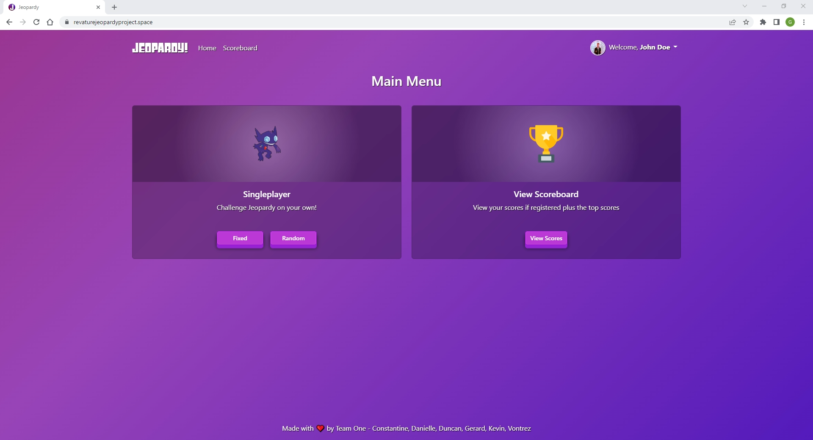
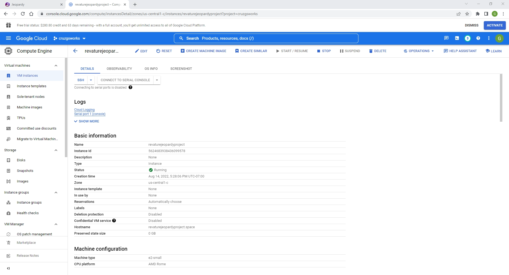
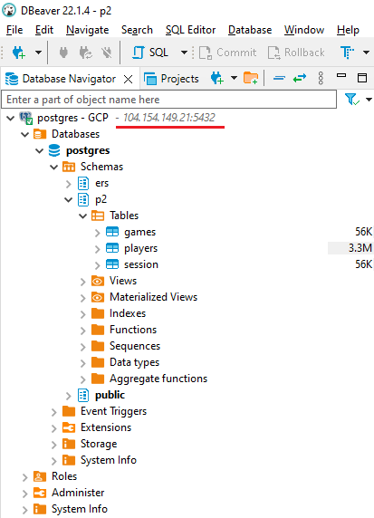

# Project 2
Jeopardy! Web Application

## Summary
Registered users can play Jeopardy game and be able to see their scores.

Requirements:
* Enable users to create their account
* Users can login or play as guest
* Retrieve questions & answers from jService API (http://jservice.io/)
* Display top scores of registered users
* Create a interface for the Jeopardy game
* Users can play the game and either win or lose points depending on their answers
* Add a time limit when user is attempting to answer a question
* Once the game is finished, tally their scores which will be stored in the DB if they're registered.

## Team 1 Members
* Danielle Abadam
* Constantine Goudas
* Duncan Stewart
* Gerard Cruz
* Vontrez White
* Kevin Trinh
  
## Technologies Used
* Spring MVC
* Angular
* JUnit
* Postgres DB
* Gradle for Java Dependencies
* GCP Cloud SQL
* GCP E2 (See Below)

## Screenshots

  * Runs in E2-Micro VM with SSL enabled

  * Screenshot of VM instance

  * Postgres DB hosted in GCP

## License
MIT